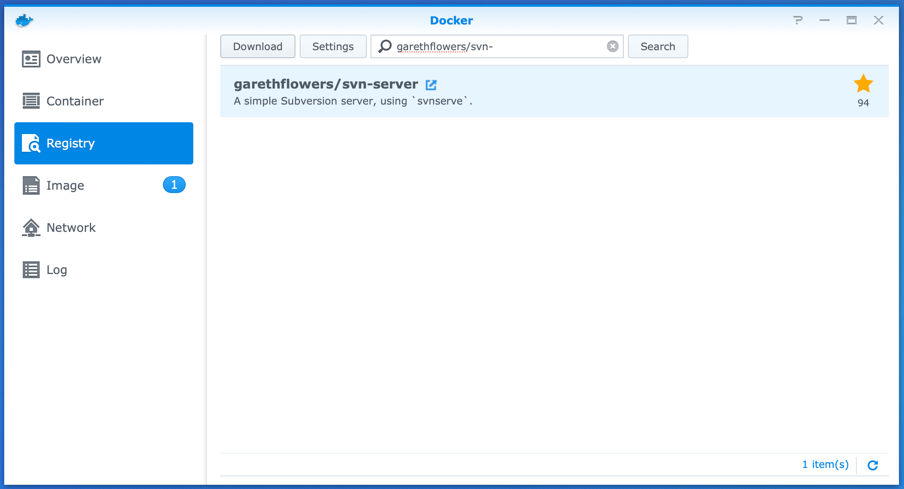
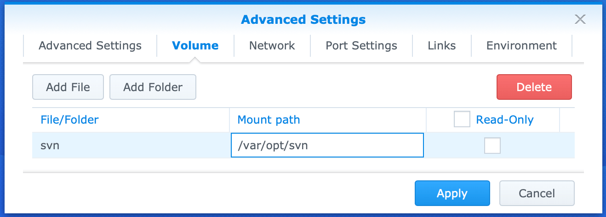
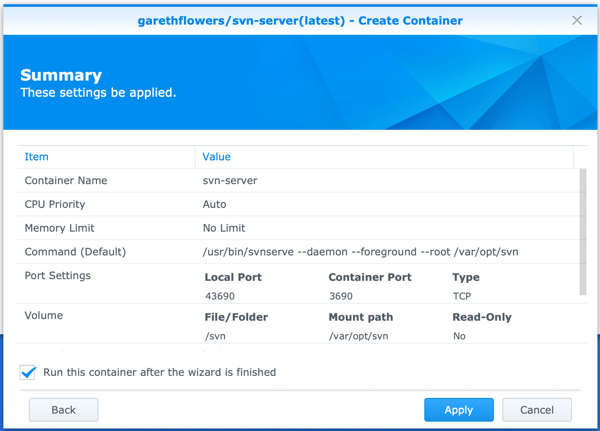
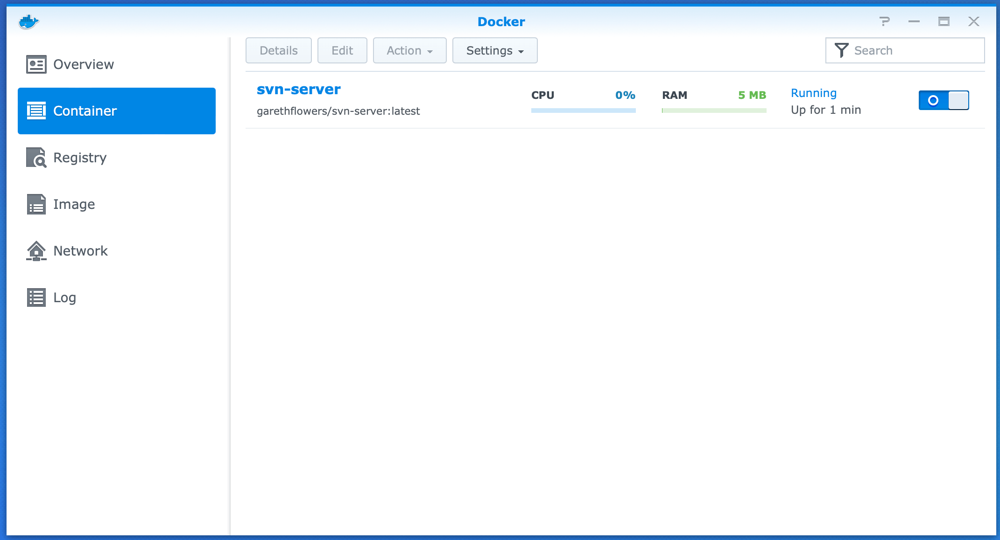
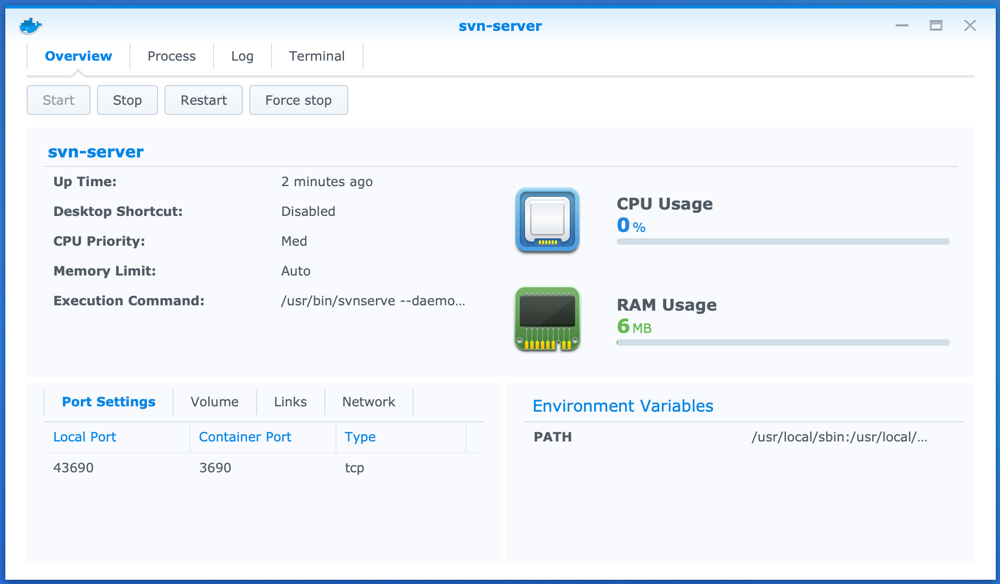
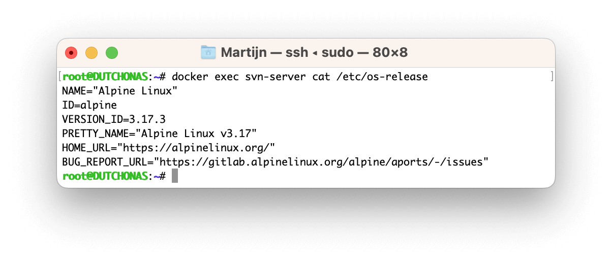

# SVN with Synology DSM 7 (and 6) and Docker ("garethflowers" image)

Detailed instructions how to use your existing SVN repositories with a lightweight Docker container on a Synology NAS with DSM 6 and above.

## Introduction

Synology DSM version 7 doesn't have the native SVN application anymore. The last DSM version 6.2 with SVN will reach [end of life](https://www.synology.com/en-global/products/status/eol-dsm62) on October 1, 2024.

Purpose: Get a working alternative for the native SVN application in DSM 6.2, so it's possible to update the NAS to DSM 7 while still using SVN.

This tutorial describes 3 steps:
1) Install the Docker application on the NAS with DSM 6.2.
2) Create a lightweight Docker container with SVN Server image that points toward your existing SVN repositories.
3) Relocate the URL of all existing local working copies to the new SVN protocol of the Docker container.

This means that no data has to be moved or renamed on the NAS. Only the repository URLs should be relocated for your working copies.

## Prerequisites
* You have an existing folder `svn` in the root (`volume1`) of your NAS with your existing repositories. This is the default folder that the native DSM SVN application uses.

## Comparison between available images

I started with the Docker image from "elleflorio". However, during the setup I discovered that it contains a pretty outdated version of SVN and that the image was no longer maintained. Hence an alternative image from "garethflowers" is found. Here is the comparison between the 2 images:

> | Image  | Maintained  | SVN Version  | Linux Alpine version  | SVN protocol  | HTTP protocol | Size  |
> |---|---|---|---|---|---|---|
> | elleflorio      | [No](https://github.com/elleFlorio/svn-docker)            |  1.9.7 (Aug-2017) | 3.5.2 (Mar-2017)  | Yes  | Yes  | 50 MB   |
> | garethflowers   | [Yes](https://github.com/garethflowers/docker-svn-server) | 1.14.2 (Apr-2022) | 3.17.3 (Mar-2023) | Yes  | No   | 17 MB   |

This page describes all the steps for the up-to-date "garethflowers" image. Clicke [here](/elleflorio.md) for the "elleflorio" image.  
Spending more time with the Docker container also resulted in more experience and a new understanding that the existing SVN repositories could just be used from their original location. Therefor the appoach on this page is more simple than for the "elleflorio" image.

## Notes

* This tutorial describes what worked for me, but is no guarantee for others. Please use all information at your own risk and without any warranty. 
* Before starting, ensure to create **backups** of your existing repositories. There is plenty of information about this, I would recommened to start simple recommended `hotcopy` command, as explained [here](https://tortoisesvn.net/docs/release/TortoiseSVN_en/tsvn-repository-backup.html).
* This Docker [image from "garethflowers"](https://github.com/garethflowers/docker-svn-server) is still maintained.
* This Docker image contains the recent SVN version 1.14.2 from April 2022, while the latest version 1.14.3 is from December 2023. See the [Subversion Release History](https://subversion.apache.org/docs/release-notes/release-history.html).
* This Docker image contains the recent Linux Alpine version 3.17.3 from March 2023, while the latest version 3.19.0 is from December 2023. See the [Linux Alpine Release History](https://www.alpinelinux.org/posts/).
* These instructions are intended for users who are not familiar with Docker and/or the Linux Command Line Interface. Hence the abundance of screenshots and explanations. I hope that the advanced reader can appreciate my effort to help a wide audience and is not offended by all "the obvious".
* All screenshots are taken on:
    * Synology DS218+ NAS with DSM version `6.2.4-25556 Update 7`.
    * Apple MacBook with macOS Ventura `13.6.3`.

## Sources

* https://github.com/garethflowers/docker-svn-server
* https://notion360.com/synology-svn/
* https://gist.github.com/dpmex4527/1d702357697162384d31d033a7d505eb

# Step 1) Install Docker

1. Log in to your Synology Disk Station.
2. Open application "Package Center".
3. Under "All Packages" search for "Docker".
4. Select package "Docker":
    
5. Click "Install"
6. Wait until the application is complete and the application status has changed to "Running":
    

# Step 2) Create a lightweight Docker container with SVN Server image

1. Open application "Docker".  
   If Package Center is still open, you can click the "Open" button. Otherwise click the Main Menu in the top left corner of DSM and select the Docker app.
2. It will show the "Welcome to Docker" popup. Although interesting to read, let's postpone that and dismiss it by clicking the "X" in the top right corner.
3. The Docker application is now running:
    
4. In the left navigation pane select "Registry". This is a convenient browser of published Docker images, similar to the App Store.
5. In the search field type `garethflowers/svn-` and click "Search":
    
6. Select `garethflowers/svn-server` and press the button "Download".  
7. A popup might appear requesting to "Choose Tag". Ensure to choose "latest" and press the button "Select".
8. When the download has started, a blue notification "1" appears behind the "Image" menu:
    
9. In the left navigation pane select "Image".
10. Wait until the download completes. Select the downloaded image named `garethflowers/svn-server:latest` and click the button "Launch".
11. Type `svn-server` as "Container Name" (__Important:__ use exact spelling as this name is required in docker command line operations later on):
    
12. Leave all other settings unchanged and click "Advanced Settings".
13. On tab "Advanced Settings" enable option "Enable auto-restart" so Docker will start this image during each power on of the NAS:
    
14. Select tab "Volume".
15. Click button "Add Folder" and browse to the folder `svn` with your existing repositories.
16. Click "Select".
17. For "Mount path" type `/var/opt/svn`:
    
18. Select tab "Port Settings". By default the ports for accessing the SVN Server are set automatically by Docker. The actual port settings can be found on the Docker Container tab under Details, as indicated in step 24. It's highly recommended to configure these ports manually, so they will always stay the same, regardless of restarts of both the Docker container and the NAS.
19. Change the "Local Port" values from "Auto" to the values below:
    
    __NOTE:__ When a port number is not available, it will be shown. Use another port and note the number for later usage.  
    __Explanation__  
    This table contains the mapping between ports on the NAS (Local Port) and in the Container. The Local Ports are necessary for the following purposes, as will be later explained:
    > | Port  | Purpose  |
    > |---|---|
    > | 43690  | SVN protocol  |
20. Finally press the button "Apply" to close the Advanced Settings and return back to the container creation (step 11):
    
21. Press "Next" to view the Summary:
    
22. Review and verify that all settings are matching the instructions and click "Apply" to create and start the container.
23. In the left navigation pane select "Container". Verify that the container is running:
    
24. Select the container and press the button "Details". It will show the port settings from step 19 in the lower left corner:
    
25. It all looks good. And you can see how lightweight it is with 0% CPU usage and only 6 MB of RAM.


## Verify the container and new SVN URL

When there is 1 or more existing repository at the NAS, it can be verified if it's accessible via the new SVN protocol of the Docker container.

Here are the parameters that will be used:

> | Parameter  | Description  |
> |---|---|
> | `<nas_ip>`      | The IP address of the NAS.  |
> | `<svn_port>`    | The Local Port for the SVN protocol from step 19 of the Docker setup (i.e. `43690`).  |
> | `<repo>`        | The name of the existing repository.  |

1. Start a command line tool on your computer, e.g. Terminal (macOS) or Windows Command shell or Powershell.
2. When still on DSM 6, first call the native SVN server via `svn info svn://<nas_ip>/<repo>`, e.g. `svn info svn://192.168.1.3/myRepo`
3. It will show information of the repo, like:
    ```
    Path: my-repo
    URL: svn://192.168.1.3/my-repo
    Relative URL: ^/
    Repository Root: svn://192.168.1.3/my-repo
    Repository UUID: e6cc68cb-dec7-438d-a041-073203402383
    Revision: 613
    Node Kind: directory
    Last Changed Author: john
    Last Changed Rev: 613
    Last Changed Date: 2023-01-07 20:33:43 +0100 (Sat, 07 Jan 2023)
    ```
4. To verify the new URL, add the local port number that redirects to the Docker image via `svn info svn://<nas_ip>:<svn_port>/<repo>`, e.g. `svn info svn://192.168.1.3:43690/my-repo`
5. This should show the exact same information, since it redirects to the same `svn` folder.

# Step 3) Relocate the URL of all existing local working copies

As seen in the previous section, the existing SVN URL is extended with the port number to the Docker container.
Fortunately all SVN tools have easy ways of relocating the URL. For example:

* [TortoiseSVN](https://tortoisesvn.net/docs/release/TortoiseSVN_en/tsvn-dug-relocate.html)
* [Xversion](https://ikoder.com) Select a working copy from the list in Xversion -> right mouse -> Relocate...
* [Command Line](https://svnbook.red-bean.com/en/1.8/svn.ref.svn.c.relocate.html)

## Verify

1. Relocate the URL of 1 repository
2. Check that it's accessable, for example by requesting the log. And if that's provided, check the changed files comparison.
3. If still OK, change 1 line of code and perform a commit.
4. Reboot your NAS to verify that the Docker container is started automatically (step 13 of the Docker setup). When it starts interact with the repository to check if it's available (e.g. request log or check changed files).

All good? Congratulations, the SVN repositories are now available via the SVN server in the Docker contaienr by the new SVN URLs. This means you're ready to update to DSM 7 and still use your existing SVN repositories.

# Step 4) Create new repository

The difference with the native SVN in DSM 6 is that this container has no graphical user interface to create a new repository.  
However, it's only 1 command to create one via the command line, via a SSH session.

## SSH into the NAS

Depending of your computer and operating system, this can be established with different tools, like PuTTY, Windows PowerShell and macOS Terminal.

1. In DSM, ensure that SSH is enabled, preferrably with a custom port (in this tutorial port 2222 is used). See this [Synology Knowledge Center article](https://kb.synology.com/en-id/DSM/tutorial/How_to_login_to_DSM_with_root_permission_via_SSH_Telnet).
2. Open your tool of choice to start the SSH session.
3. Start the SSH connection by typing: `sudo ssh <user_name>@<nas_ip> -p <ssh_port>`, e.g. `sudo ssh john@192.168.1.3 -p 2222`
4. First the password of your **local machine** is requested (due to the `sudo` command). Type it and press the ENTER key.
5. When the password is correct, it will request the password for `<user_name>` of the NAS. Type it and press the ENTER key.
6. When the password is correct, you will be logged into the NAS.
7. To create a SVN repository in the next section, sudo permissions are required. Hence type `sudo -i`. Again enter the password for `<user_name>` and press the ENTER key. Now the SSH connection is established with root permissions:
    
8. Optional: It's possible to request the version of the Linux Alpine version inside the Docker container by typing: `docker exec <container> cat /etc/os-release`, e.g. `docker exec svn-server cat /etc/os-release`  
    > | Parameter  | Description  |
    > |---|---|
    > | `<container>` | The name of the docker container from step 11 of the Docker setup (e.g. `svn-server`).  |
    This image uses version 3.17.3:
    

## Create a new SVN repository

1. To create a new repository via the Docker container type: `docker exec -it <container> svnadmin create <repo>`, e.g. `docker exec -it svn-server svnadmin create test-repo`  
    > | Parameter  | Description  |
    > |---|---|
    > | `<container>`   | The name of the docker container from step 11 of the Docker setup (e.g. `svn-server`).  |
    > | `<repo>`        | The name of the new repository.  |
2. It can be verified via the `svn status` command, as done [before](./README.md#verify-the-container-and-new-svn-url). So for the new repo with name `test-repo` type: `svn info svn://192.168.1.3/test-repo`
3. It will show information of the new repo at Revision 0, like:
    ```
    Path: test-repo
    URL: svn://192.168.1.3:43690/test-repo
    Relative URL: ^/
    Repository Root: svn://192.168.1.3:43690/test-repo
    Repository UUID: c5a052fe-2872-4bd0-a256-d93a3a4ecea6
    Revision: 0
    Node Kind: directory
    Last Changed Rev: 0
    Last Changed Date: 2024-01-07 18:08:42 +0100 (Sun, 07 Jan 2024)
    ```
4. The last step is to configure the access rights of this repository. This can be done by editing the files in the folder `conf` of the new repository. For example with an editor like VI.  
    Or if you want to re-use the same configuration from an existing repository, copy the files `svnserve.conf`, `passwd` and `authz` from that respository and override the default ones in the new repository. 
    In that case enter the following 3 commands in the terminal and replace `my-repo` with the name of the existing repository:
    ```
    cp /volume1/svn/my-repo/conf/svnserve.conf /volume1/svn/test-repo/conf/
    cp /volume1/svn/my-repo/conf/passwd /volume1/svn/test-repo/conf/
    cp /volume1/svn/my-repo/conf/authz /volume1/svn/test-repo/conf/
    ```
    More information about this topic can be found on the internet, for example at the bottom of [this article](https://notion360.com/synology-svn/).

## Delete a SVN repository

1. All (new) repositories are just visible in DSM via the "File Station" application in the folder `svn`.
2. Just select a folder within it, such as the newly created `test-repo` and delete it.
