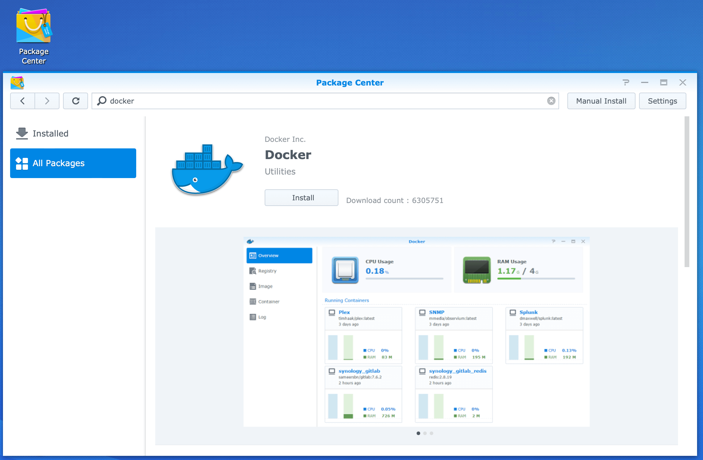
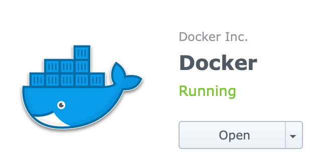
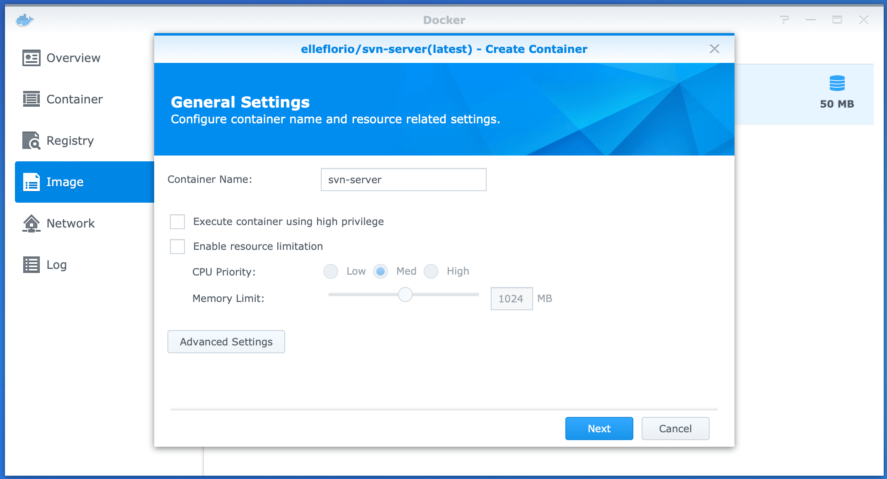
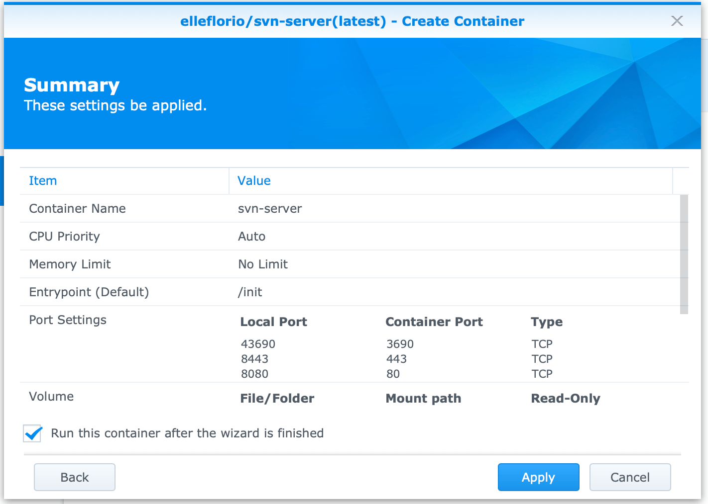
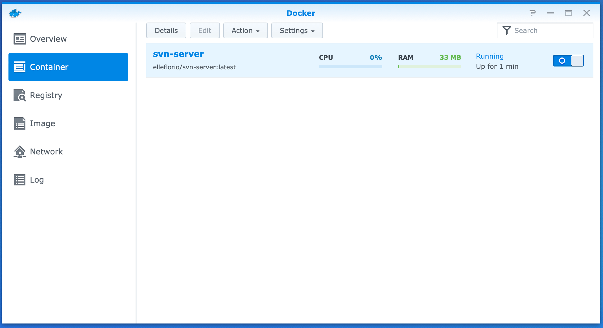
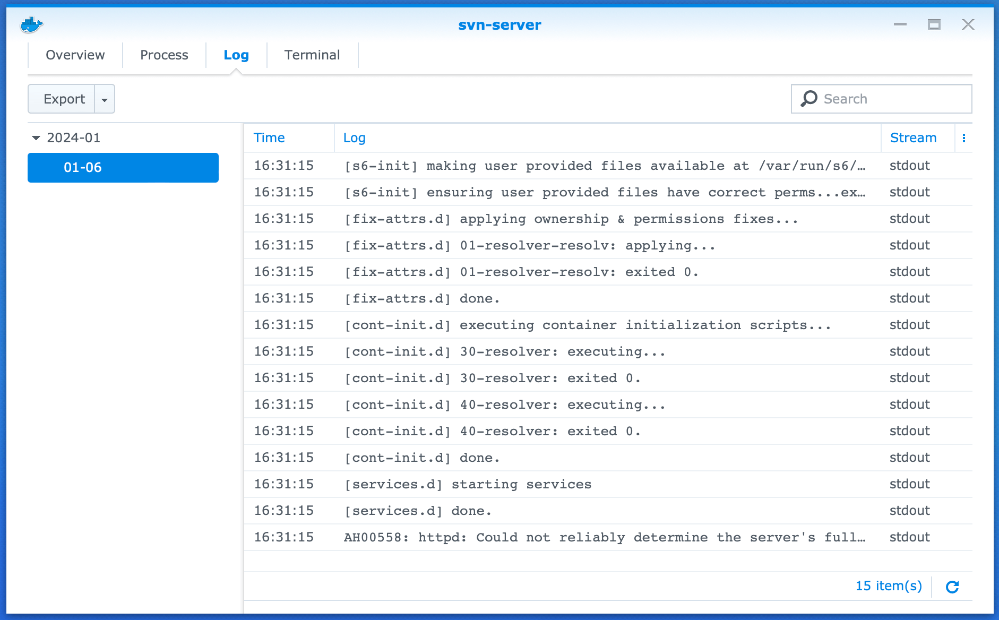
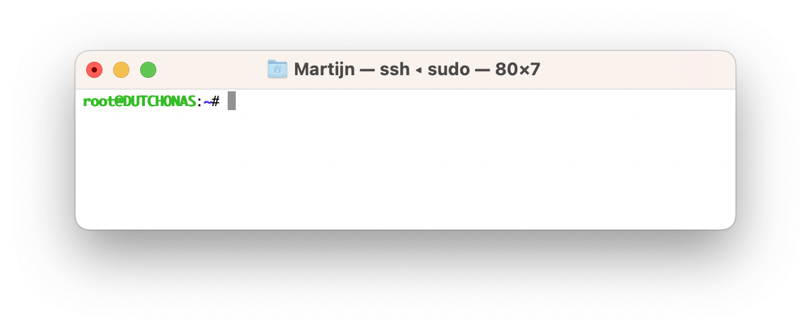
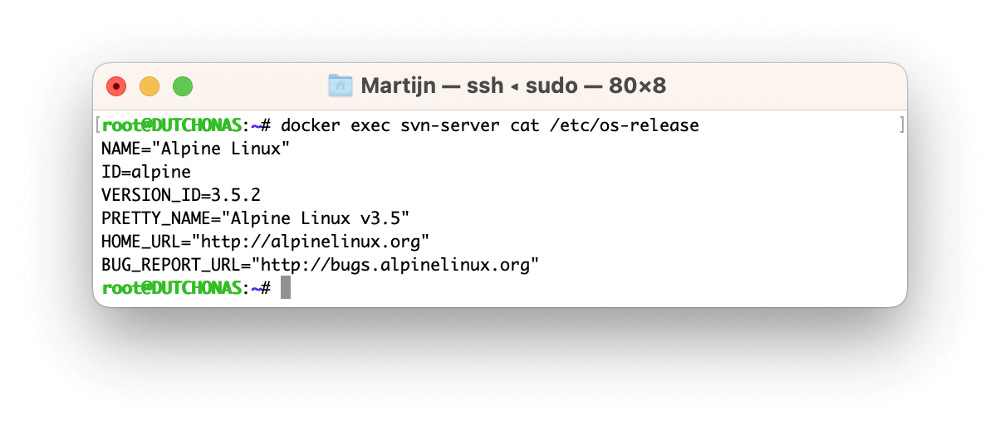

# SVN with Synology DSM 7 (and 6) and Docker ("elleflorio" image)

Detailed instructions how to use your existing SVN repositories with a lightweight Docker container from ["elleflorio"](https://github.com/elleFlorio/svn-docker) on a Synology NAS with DSM 6 and above.

## Notes

* This tutorial describes what worked for me, but is no guarantee for others. Please use all information at your own risk and without any warranty. 
* Before starting, ensure to create **backups** of your existing repositories. There is plenty of information about this, I would recommened to start simple recommended `hotcopy` command, as explained [here](https://tortoisesvn.net/docs/release/TortoiseSVN_en/tsvn-repository-backup.html).
* This Docker [image from "elleflorio"](https://github.com/elleFlorio/svn-docker) is no longer maintained.
* This Docker image contains SVN version 1.9.7 from August 2017, while the latest version 1.14.3 is from December 2023. See the [Subversion Release History](https://subversion.apache.org/docs/release-notes/release-history.html).
* This Docker image contains the Linux Alpine version 3.5.2 from March 2017, while the latest version 3.19.0 is from December 2023. See the [Linux Alpine Release History](https://www.alpinelinux.org/posts/).
* These instructions are intended for users who are not familiar with Docker and/or the Linux Command Line Interface. Hence the abundance of screenshots and explanations. I hope that the advanced reader can appreciate my effort to help a wide audience and is not offended by all "the obvious".
* All screenshots are taken on:
    * Synology DS218+ NAS with DSM version `6.2.4-25556 Update 7`.
    * MacBook with macOS Ventura `13.6.3 `.

## Important

Based on the first 2 notes we have decided to use another image from ["garethflowers"](./README.md), which is maintained and contains the almost latest SVN version 1.14.2 from April 2022.  
For anyone who is still interested in the discontinued "elleflorio" image, we have left the instructions below.

## Sources

* https://notion360.com/synology-svn/
* https://www.synoforum.com/threads/running-svn-in-docker.9099/page-2
* https://gist.github.com/dpmex4527/1d702357697162384d31d033a7d505eb

# Install Docker

1. Log in to your Synology Disk Station.
2. Open application "Package Center".
3. Under "All Packages" search for "Docker".
4. Select package "Docker":
    
5. Click "Install"
6. Wait until the application is complete and the application status has changed to "Running":
    

# Create SVN folder for Docker

1. Open application "File Station".
2. You will see a new folder "docker" that is created automatically on the root level of your NAS:
    
3. Select this folder.
4. From the Menu bar in File Station, click button "Create" and select "Create folder".
5. Type `svn` as folder name and press "OK" to create this folder:
    

The NAS is now ready to create a Docker container.

# Create a lightweight Docker container with SVN Server image

1. Open application "Docker".  
   If Package Center is still open, you can click the "Open" button. Otherwise click the Main Menu in the top left corner of DSM and select the Docker app.
2. It will show the "Welcome to Docker" popup. Although interesting to read, let's postpone that and dismiss it by clicking the "X" in the top right corner.
3. The Docker application is now running:
    
4. In the left navigation pane select "Registry". This is a convenient browser of published Docker images, similar to the App Store.
5. In the search field type `elleflorio/svn` and click "Search":
    
6. Select `elleflorio/svn-server` and press the button "Download".  
7. A popup might appear requesting to "Choose Tag". Ensure to choose "latest" and press the button "Select".
8. When the download has started, a blue notification "1" appears behind the "Image" menu:
    
9. In the left navigation pane select "Image".
10. Wait until the download completes. Select the downloaded image named `elleflorio/svn-server:latest` and click the button "Launch".
11. Type `svn-server` as "Container Name" (__Important:__ use exact spelling as this name is required in docker command line operations later on):
    
12. Leave all other settings unchanged and click "Advanced Settings".
13. On tab "Advanced Settings" enable option "Enable auto-restart" so Docker will start this image during each power on of the NAS:
    
14. Select tab "Volume".
15. Click button "Add Folder" and browse to the folder `docker` -> `svn` that is created earlier:
    
16. Click "Select".
17. For "Mount path" type `/home/svn`:
    
18. Select tab "Port Settings". By default the ports for accessing the SVN Server are set automatically by Docker. The actual port settings can be found on the Docker Container tab under Details, as indicated in step 24. It's highly recommended to configure these ports manually, so they will always stay the same, regardless of restarts of both the Docker container and the NAS.
19. Change the "Local Port" values from "Auto" to the values below:
    
    __NOTE:__ When a port number is not available, it will be shown. Use another port and note the number for later usage.  
    __Explanation__  
    This table contains the mapping between ports on the NAS (Local Port) and in the Container. The Local Ports are necessary for the following purposes, as will be later explained:
    > | Port  | Purpose  |
    > |---|---|
    > | 43690  | SVN protocol  |
    > | 8443  | HTTPS protocol  |
    > | 8080  | HTTP protocol  |
20. Finally press the button "Apply" to close the Advanced Settings and return back to the container creation (step 11):
    
21. Press "Next" to view the Summary:
    
22. Review and verify that all settings are matching the instructions and click "Apply" to create and start the container.
23. In the left navigation pane select "Container". Verify that the container is running:
    
24. Select the container and press the button "Details". It will show the port settings from step 19 in the lower left corner:
    
25. Click the button "Log" to show the container log:
    
26. It all looks good, except the last line. However, this is no issue for now and will be addressed later.

# SSH into the NAS to setup SVN

Now that the Docker container with SVN is running, it's time to setup the SVN server.  
Where on DSM 6 and before that was easily done via the graphical interface of the SVN Server application, it needs to be done via the command line in the Docker container.

Therefor a SSH session to the NAS should be started. Depending of your computer and operating system, this can be established with different tools, like PuTTY, Windows PowerShell and macOS Terminal.

1. In DSM, ensure that SSH is enabled, preferrably with a custom port (in this tutorial port 2222 is used). See this [Synology Knowledge Center article](https://kb.synology.com/en-id/DSM/tutorial/How_to_login_to_DSM_with_root_permission_via_SSH_Telnet).
2. Open your tool of choice to start the SSH session.
3. Start the SSH connection by typing: `sudo ssh <user_name>@<nas_ip> -p <ssh_port>`, e.g. `sudo ssh john@192.168.1.3 -p 2222`
4. First the password of your local machine is requested (due to the `sudo` command). Type it and press the ENTER key.
5. When the password is correct, it will request the password for `<user_name>` on the nas. Type it and press the ENTER key.
6. When the password is correct, you will be logged in the NAS.
7. To configure SVN in the next section, sudo permissions are required. Hence type `sudo -i`. Again enter the password for `<user_name>` and press the ENTER key. Now the SSH connection is established with root permissions:
    
8. It's possible to request the version of the Linux Alpine version inside the Docker container by typing: `docker exec <container> cat /etc/os-release`, e.g. `docker exec svn-server cat /etc/os-release`  
    > | Parameter  | Description  |
    > |---|---|
    > | `<container>` | The name of the docker container from step 11 of the Docker setup (e.g. `svn-server`).  |
    This image uses version 3.5.2:
    

# Setup HTTP protocol credentials

An important step is to setup the credentials for the HTTP protocol of the SVN server.  
For easy migration of your existing SVN server it's recommended to reuse the same HTTP credentials (if they exist).

1. Ensure to SSH into the NAS as described in the previous section.
2. In the SSH terminal type `docker exec -t <container> htpasswd -b  /etc/subversion/passwd <username> <password>`, e.g. `docker exec -t svn-server htpasswd -b /etc/subversion/passwd Sally secret`
    > | Parameter  | Description  |
    > |---|---|
    > | `<container>` | The name of the docker container from step 11 of the Docker setup (e.g. `svn-server`).  |
    > | `<username>`  | The desired (or existing) user name for HTTP access to the SVN server.  |
    > | `<password>`  | The password for `<username>` for HTTP access to the SVN server.   |
3. When succesfull, the output will show `Adding password for user <user>`.
4. It's now possible to verify the HTTP protocol credentials by opening the browser and entering the following URL: `http://<nas_ip>:<http_port>/svn`, e.g. `http://192.168.1.3:8080/svn` (do not use http**s**)  
    > | Parameter  | Description  |
    > |---|---|
    > | `<nas_ip>`    | The IP address of the NAS.  |
    > | `<http_port>` | The Local Port for the **HTTP** (not HTTP**S**) protocol from step 19 of the Docker setup (i.e. `8080`).  |
5. It should request for the credentials that were just assigned:
    
6. Enter the credentials from step 2 and now an empty repository should be shown:
    

Please note that the Docker image contains a pretty outdated version 1.9.7 of SVN. It is from August 2017, while the latest version 1.14.3 is from December 2023. See the [Subversion Release History](https://subversion.apache.org/docs/release-notes/release-history.html).  
The svn version of the Docker image can also be requested from the command line; type `docker exec <container> svn --version`, e.g. `docker exec svn-server svn --version`

> | Parameter  | Description  |
> |---|---|
> | `<container>` | The name of the docker container from step 11 of the Docker setup (e.g. `svn-server`).  |

DSM 6.2.4-25556 Update 7 is shipped with version 1.14.0 from May 2020 as can be seen when entering `svn --version` in the SSH Terminal.  
Based on this I have decided to install the more up-to-date ["garethflowers"](./README.md) image.

# Setup SVN repositories

This is similarly as described for the ["garethflowers"](./README.md#Setup-SVN-repositories) image.

# Issues

* When making a commit, an error was shown like "Error: Access to '/svn/Demo/!svn/me' forbidden". This was resolved by starting a SSH session into the NAS (see above) and typing the [following command](https://github.com/elleFlorio/svn-docker/issues/19): `docker exec -t svn-server sed -i "s/= r/= rw/g" /etc/subversion/subversion-access-control`